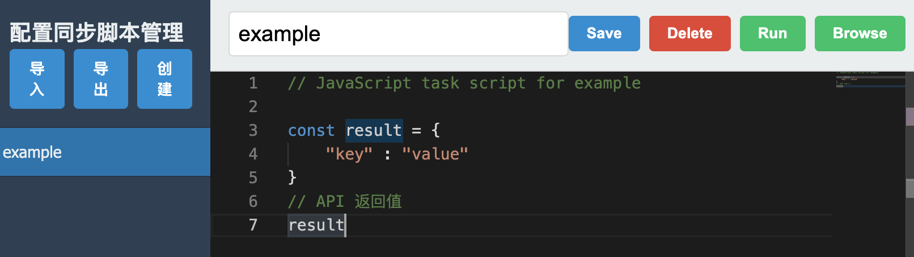
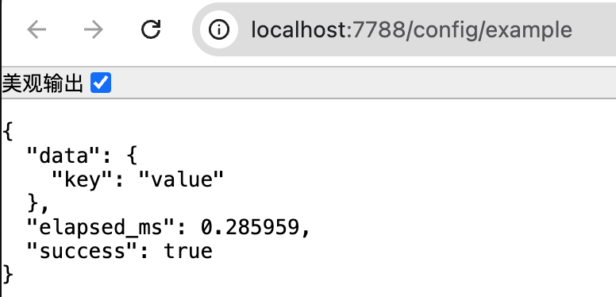

# Go + Javascript 脚本化业务框架

本仓库代码的目标是基本Go搭建一个分布式业务构架，提供常见业务的基础框架和中间件能力支持。上层支持通过 Javascript 脚本化来快速完成业务。

思路上，使用 Go 为微服务应用提供稳定并轻量的底层框架能力（相比 Java 等资源消耗型框架），借助 Javascript 动态语言的能力完成细粒度和灵活的业务变更。

该框架是从作者自用的 MES 应用中裁剪出来，移除了 InfluxDB 和 MQTT 等常规业务无关的功能。

- [x] Nacos配置中心支持
- [x] JavaScript 脚本支持
- [x] MySQL数据库
- [x] Redis支持
- [ ] javascript 微服务
- [ ] 版本化的脚本管理

## WEB 请求

框架基于 Gin 内置了一个 Web Server（默认地址 http://localhost:7788 ），并且支持通过新增脚本来增加新的 API 请求。

## 基础 API

目前提供了以下基础 API 以支撑常规业务:

### 日志

- console.log - 日志输出

### Redis
- redis.set - Redis Redis 常规和 HSET key 写入
- redis.get - Redis Redis 常规和 HSET key 读取
- redis.keys - Redis HSET HKEYS操作
- redis.hgetall
- redis.sadd
- redis.srem
- redis.scard
- redis.smembers

### MySQL

- mysql.query
- mysql.exec
- mysql.queryRow
- mysql.transaction

### Net

- net.fetch - GET / POST 支持

### 系统命令

- sys.command

## 配置文件

文件 `config.yaml` 是运行所需的配置文件，用于定义 nacos、mysql、redis 配置，以及 webs server API 路径配置。

通过修改配置，很容易实现不同端点的 API 配置。